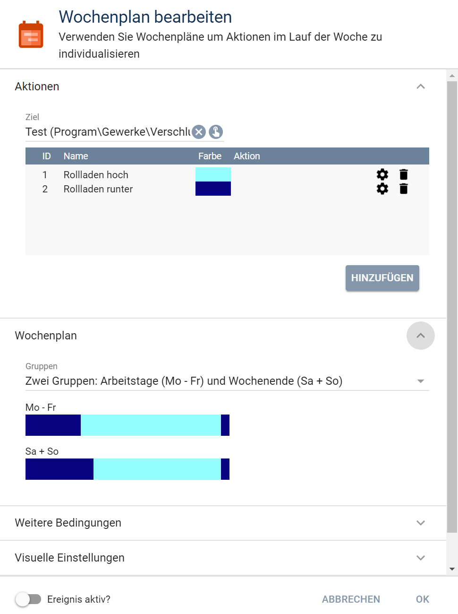

# Blind Control

Modul für Symcon ab Version 5.1.

Steuert einen Rollladen nach vorgegebenen Einstellungen.

## Dokumentation

**Inhaltsverzeichnis**

1. [Funktionsumfang](#1-funktionsumfang)  
2. [Voraussetzungen](#2-voraussetzungen)  
3. [Installation](#3-installation)  
4. [Funktionsreferenz](#4-funktionsreferenz)
5. [Konfiguration](#5-konfiguration)  
6. [Anhang](#6-anhang)  

## 1. Funktionsumfang

Das Blind Control Modul dient der Steuerung von Rollläden oder anderweitigen Abdunkelungseinrichtungen.


## 2. Voraussetzungen

 - Symcon 5.1
 
 - Es werden alle Aktoren unterstützt, die über eine Statusvariable verfügen und sich über RequestAction steuern lassen.
Die Statusvariable muss vom Typ Float sein und ein Profil mit einem korrekten Minimal- und Maximalwert besitzen. Bei einem Rollladen, der beim Minimalwert 
geschlossen und beim Maximalwert geöffnet ist, ist ein Profil mit der Namensendung ".Reversed" zu verwenden.  

## 3. Installation

### a. Laden des Moduls

In Symcon unter Kerninstanzen über `Modules -> Hinzufügen` das Modul ergänzen mit der URL:
	
    `https://github.com/bumaas/BlindControl/`  

### b. Anlegen einer Instanz

In Symcon an beliebiger Stelle `Instanz hinzufügen` auswählen und `Blind Controller` auswählen.
	

## 4. Funktionsreferenz

```php
BLC_ControlBind(int $InstanceID)
```
Prüft die Rollladenposition gemäß der in der Instanz festgelegten Eigenschaften und fährt ihn auf die ermittelte Position.

```php
BLC_MoveBlind(int $level, int $deactivationTimeAuto): bool
```
Fährt den Rollladen auf die gewünschte Position.
$level: 0 - 100
Angabe des Levels (0=geöffnet, 100 = geschlossen)
$deactivationTimeAuto: Anzahl der Sekunden, die mindestens seit der letzten automatischen Bewegung vergangen sein müssen. Sonst wird der Rollladen nicht bewegt.


## 5. Konfiguration

Für die Fahrzeiten ist ein Wochenplan Ereignis anzulegen mit folgenden Einstellungen:
 
)

**Wichtig:** 
- der Wochenplan muss genau zwei Aktionen mit ID 1 und ID 2 beinhalten.
- Die Aktion mit ID 1 stellt dabei die Aktion zum Hochfahren des Rollladens und die ID 2 die Aktion zum Runterfahren des Rollladens dar.
- Es darf nur maximal einen Zeitraum zur Aktion 2 geben. 

### Blind Controller

| Eigenschaft | Typ     | Standardwert            | Funktion                                  |
| :--------- | :-----: | :------------------------| :--------------------------------------- |
| BlindLevelID               | integer | 0 | Statusvariable, des zu steuernden Rollladens. Sie muss vom Typ Float sein und über einen Wertebereich von 0.0 - 1.0 verfügen. |
| IsDayIndicatorID           | integer | 0 | Indikatorvariable, die den anzeigt, ob es Tag oder Nacht ist. Es kann z.B. die ISDAY Statusvariable des Location Controls genutzt werden.
| BrightnessID               | integer | 0 | Indikatorvariable, die die Helligkeit zur Tag/Nacht Bestimmung abbildet.  |
| BrightnessThresholdID      | integer | 0 | Indikatorvariable, die den Schwellwert zur Tag/Nacht Bestimmung zur Verfügung stellt |
| WeeklyTimeTableEventID     | integer | 0 | Verweis auf ein Wochenplanevent, dass die täglichen Grundzeiten für Rollladen rauf und Rollladen runter abbildet.       |                  |
| WakeUpTimeID               | integer | 0 | - noch nicht unterstützt -|
| HolidayIndicatorID         | integer | 0 | Indikatorvariable, die anzeigt, ob ein Urlaubs-/Feiertag anliegt|
| DayUsedWhenHoliday         | integer | 0 | legt fest, welcher Wochentag des Wochenplans im Fall eines Urlaubs-/Feiertages herangezogen werden soll|
| UpdateInterval             | integer | 1 | legt fest, in welchem Intervall die Steuerung durchgeführt wird |
| DeactivationAutomaticMovement | integer | 20| legt fest, wie lange nach einer automatischen Rollladenfahrt keine weitere automatische Fahrt mehr stattfinden soll. Das verhindert, dass z.B. bei Helligkeitsschwankungen der Rollladen in zu kleinen Intervallen bewegt wird.|
| DeactivationManualMovement | integer | 120  | legt fest, wie lange nach einer Rollladenfahrt, die nicht durch diese Steuerung veranlasst wurde (z.B. nach einer manuelle Betätigung) keine weitere automatische Fahrt mehr stattfinden soll.|


## 6. Anhang

###  GUIDs und Datenaustausch

#### Blind Control Modul

GUID: `{7995e8c8-bd15-46a1-8ab6-2b795c33c0c5}` 

#### Blind Controller

GUID: `{538f6461-5410-4f4c-91d3-b39122152d56}` 


