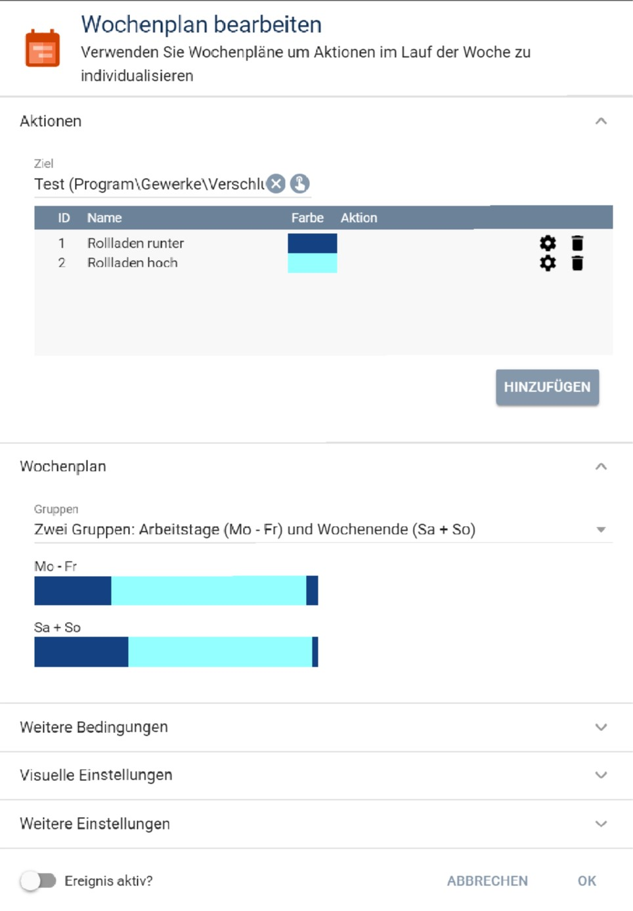
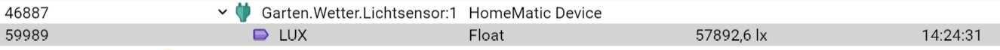
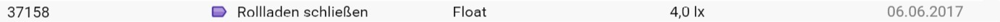

# Blind Control

Modul für Symcon ab Version 5.1.

Steuert einen Rollladen nach vorgegebenen Einstellungen.

## Dokumentation

**Inhaltsverzeichnis**

1. [Funktionsumfang](#1-funktionsumfang)  
2. [Voraussetzungen](#2-voraussetzungen)  
3. [Installation](#3-installation)  
4. [Funktionsreferenz](#4-funktionsreferenz)
5. [Konfiguration](#5-konfiguration)  
6. [Anhang](#6-anhang)  

## 1. Funktionsumfang

Das Blind Control Modul dient der Steuerung von Rollläden oder anderweitigen Abdunkelungseinrichtungen.


## 2. Voraussetzungen

 - Symcon 5.1
 
 - Es werden alle Aktoren unterstützt, die über eine Statusvariable verfügen und sich über RequestAction steuern lassen.
Die Statusvariable muss vom Typ Integer oder Float sein und ein Profil mit einem korrekten Minimal- und Maximalwert besitzen. Bei einem Rollladen, der beim Minimalwert 
geschlossen und beim Maximalwert geöffnet ist, ist ein Profil mit der Namensendung ".Reversed" zu verwenden.  

## 3. Installation

### a. Laden des Moduls

In Symcon unter Kerninstanzen über `Modules -> Hinzufügen` das Modul ergänzen mit der URL:
	
    `https://github.com/bumaas/BlindControl/`  

### b. Anlegen einer Instanz

In Symcon an beliebiger Stelle `Instanz hinzufügen` auswählen und `Blind Controller` auswählen.
	

## 4. Funktionsreferenz

```php
BLC_ControlBlind(int $InstanceID, bool $considerDeactvationTimes)
```
Prüft die Rollladenposition gemäß der in der Instanz festgelegten Eigenschaften und fährt den Rollladen auf die ermittelte Position. Wenn $considerDeactivationTimes == true, dann wird DeactivationAutomaticMovement berücksichtigt.

```php
BLC_MoveBlind(int $InstanceID, int $percentClose, int $deactivationTimeAuto): bool
```
Fährt den Rollladen auf den gewünschten Schließungsgrad.
$percentClose: 0 - 100
Angabe des Schließungsgrades (0=geöffnet, 100 = geschlossen)
$deactivationTimeAuto: Anzahl der Sekunden, die mindestens seit der letzten automatischen Bewegung vergangen sein müssen. Sonst wird der Rollladen nicht bewegt.


## 5. Konfiguration

### Überprüfen, ob der zu steuernde Rollladen korrekt in IP-Symcon eingerichtet ist

Damit das Modul korrekt arbeiten kann, ist eine richtige und vollständige Einrichtung des zu steuernden Rollladens in IP-Symcon Voraussetzung. Es muss sichergestellt sein, dass der Rollladen sich korrekt positionieren lässt (offen, geschlossen und in Zwischenstufen) und die Laufrichtung richtig erkannt wird.
Dies lässt sich am einfachsten überprüfen, indem die zu steuernde Positions Variable (bei Homematic z.B. LEVEL genannt) mit einem adaptiven Icon (z.B. "Jalousie") versehen wird und das Webfront eingebunden wird.

Nun sollte sich im Webfront folgendes Bild für einen geöffneten bzw. geschlossenen Rollladen ergeben:


Zeigt das Icon den falschen Zustand an, dann ist dem Profil im Namen ein '.Reversed' anzuhängen. Man erreicht dies, indem ein bestehendes Profil kopiert wird und dabei der Name ergänzt wird.


### Einrichtung des Wochenplans
Für die Fahrzeiten ist ein Wochenplan Ereignis anzulegen mit folgenden Einstellungen:
 


Das Modul holt aus dem Wochenplan ausschließlich die Aktionszeiten und den Aktionstyp.

**Wichtig:** 
- der Wochenplan muss genau zwei Aktionen mit ID 1 und ID 2 beinhalten. Die eigentlichen Aktionen bleiben dabei jedoch leer, da der Wochenplan nicht von IP-Symcon direkt ausgeführt werden soll.
- Die Aktion mit ID 1 stellt dabei die Aktion zum Runterfahren des Rollladens und die ID 2 die Aktion zum Hochfahren des Rollladens dar.
- Es darf nur maximal einen Zeitraum zur Aktion 2 (Hochfahren) geben.
- ob ein Wochenplan aktiv ist oder nicht wird nicht berücksichtigt

Über den Wochenplan werden die Grundfahrzeiten (morgens hoch/ abends runter) definiert.

### Tagerkennung (optional)
Als Ergänzung zum Wochenplan kann eine zusätzliche Tagerkennung eingerichtet werden. Sie kommt zum Einsatz, wenn neben den Fahrzeiten gemäß Wochenplan auch die Helligkeit berücksichtigt werden soll.

Beispiel:
 
Der Rollladen wird gemäß Wochenplan morgens um 8:00 Uhr hochgefahren und abends um 23:00 Uhr wieder herunter.
Er soll aber nur dann hochgefahren werden, wenn es Tag ist und nur dann heruntergefahren werden, wenn es nicht mehr Tag ist.

Hierzu kann die Tagerkennung zusätzlich eingerichtet werden. Dann ist der Rollladen nur dann hochgefahren, wenn beide Bedingungen (Öffnungszeit laut Wochenplan und "es ist Tag") erfüllt sind.

Damit der Tag erkannt wird, kann entweder auf eine bereits bestehenden Variable verwiesen werden (hier bietet sich die 'IsDay' Variable des Location Moduls an) oder durch einen Helligkeitsvergleich erfolgen.
Für einen Helligkeitsvergleich ist die Variable anzugeben, die den aktuellen Helligkeitswert beinhaltet (z.B. von einem Helligkeitssensor) sowie eine Variable, die den Schwellwert beinhaltet.
 



### Blind Controller

| Eigenschaft | Typ     | Standardwert            | Funktion                                  |
| :--------- | :-----: | :------------------------| :--------------------------------------- |
| BlindLevelID               | integer | 0 | Statusvariable, des zu steuernden Rollladens. Sie muss vom Typ Integer oder Float sein und über ein korrektes Profil verfügen. |
| WeeklyTimeTableEventID     | integer | 0 | Verweis auf ein Wochenplanevent, dass die täglichen Grundzeiten für Rollladen rauf und Rollladen runter abbildet.       |                  |
| WakeUpTimeID               | integer | 0 | Indikatorvariable vom Typ String, die eine übersteuernde Hochfahrzeit beinhaltet. Die Zeit muss im Format 'HH:MM' angegeben sein|
| WakeUpTimeOffset               | integer | 0 | Offset zur WakeUpTime in Minuten|
| BedTimeID               | integer | 0 | Indikatorvariable vom Typ String, die eine übersteuernde Runterfahrzeit beinhaltet. Die Zeit muss im Format 'HH:MM' angegeben sein|
| BedTimeOffset               | integer | 0 | Offset zur BedTime in Minuten|
| HolidayIndicatorID         | integer | 0 | Indikatorvariable, die anzeigt, ob ein Urlaubs-/Feiertag anliegt|
| DayUsedWhenHoliday         | integer | 0 | legt fest, welcher Wochentag des Wochenplans im Fall eines Urlaubs-/Feiertages herangezogen werden soll|
| IsDayIndicatorID           | integer | 0 | Indikatorvariable, die anzeigt, ob es Tag oder Nacht ist. Es kann z.B. die ISDAY Statusvariable des Location Controls genutzt werden.
| BrightnessID               | integer | 0 | Indikatorvariable, die die Helligkeit zur Tag/Nacht Bestimmung abbildet.  |
| BrightnessThresholdID      | integer | 0 | Indikatorvariable, die den Schwellwert zur Tag/Nacht Bestimmung zur Verfügung stellt |
| Contact1ID, Contact2ID       | integer | 0 | Indikatorvariablen: wenn eine der Variablen ungleich 0 ist, dann wird der Rollladen auf die unter 'ContactOpenLevel' angegebene Position gefahren
| ContactOpenLevel           | float   | 0 | Position, auf die der Rollladen mindestens gefahren wird, wenn ein Kontakt offen ist.
| ActivatorIDShadowingBrightness | integer   | 0 | 
| BrightnessIDShadowingBrightness| integer   | 0 | 
| ThresholdIDHighBrightness      | integer   | 0 | 
| ThresholdIDLessBrightness      | integer   | 0 | 
| UpdateInterval             | integer | 1 | legt fest, in welchem Intervall die Steuerung durchgeführt wird |
| DeactivationAutomaticMovement | integer | 20| legt fest, wie lange nach einer automatischen Rollladenfahrt keine weitere automatische Fahrt mehr stattfinden soll. Das verhindert, dass z.B. bei Helligkeitsschwankungen der Rollladen in zu kleinen Intervallen bewegt wird.|
| DeactivationManualMovement | integer | 120  | legt fest, wie lange nach einer Rollladenfahrt, die nicht durch diese Steuerung veranlasst wurde (z.B. nach einer manuelle Betätigung) keine weitere automatische Fahrt mehr stattfinden soll.|
| WriteLogInformationToIPSLogger | boolean | false  | legt fest, ob die Log Informationen zusätzlich zum Standard Logfile auch an den IPSLogger der IPSLibrary übergeben werden sollen|
| WriteDebugInformationToIPSLogger | boolean | false  | legt fest, ob die Debug Informationen zusätzlich zum Debugger auch an den IPSLogger der IPSLibrary übergeben werden sollen|
| WriteDebugInformationToLogfile | boolean | false  | legt fest, ob die Debug Informationen zusätzlich in das Standard Logfile geschrieben werden sollen. Wichtig: dazu muss der Symcon Spezialschalter 'LogfileVerbose' aktiviert sein
 
## 6. Statusvariablen und Profile

Folgende Statusvariablen werden angelegt:

#####ACTIVATED
Über die Statusvariable kann die automatische Steuerung aktiviert und deaktiviert werden.

#####LAST_MESSAGE
Die Statusvariable beinhaltet einen Hinweis über die letzte Bewegung.

## 7. Anhang

###  GUIDs und Datenaustausch

#### Blind Control Modul

GUID: `{7995E8C8-BD15-46A1-8AB6-2B795C33C0C5}` 

#### Blind Controller

GUID: `{538F6461-5410-4F4C-91D3-B39122152D56}` 


