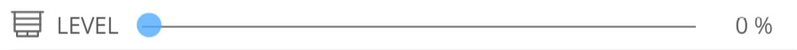

[](https://www.symcon.de/forum/threads/30857-IP-Symcon-5-1-%28Stable%29-Changelog)
[](https://www.paypal.me/bumaas)
# Blind Control

Modul für Symcon ab Version 5.1.

Steuert einen Rollladen bzw. eine Jalousie nach vorgegebenen Einstellungen.

## Dokumentation

**Inhaltsverzeichnis**

1. [Funktionsumfang](#1-funktionsumfang)  
2. [Voraussetzungen](#2-voraussetzungen)  
3. [Installation](#3-installation)  
4. [Funktionsreferenz](#4-funktionsreferenz)
5. [Konfiguration](#5-konfiguration)  
6. [Statusvariablen und Profile](#6-statusvariablen-und-profile)  
7. [Anhang](#7-anhang)
    1. [GUIDs der Module](#guids-der-module)
    2. [Spenden](#spenden)

## 1. Funktionsumfang
Das Blind Control Modul dient der Steuerung von Rollläden oder anderweitigen Abdunkelungseinrichtungen.

Aktuelle Features:
- Hoch-/Runterfahren zu vorgegebenen Zeiten
- Lamellenstellung bei Jalousien
- Urlaubs- und Feiertagsberücksichtigung
- Berücksichtigung von Sonnenauf- und -untergang
- Berücksichtigung der Helligkeit
- Sonnenschutz inclusive Nachführen nach Sonnenstand
- Zufallsfunktion bei Tagesanfang/Tagesende
- Unterstützung von Kontakten (Fenster/Tür, Regen, Alarm etc.)
- Hitzeschutz
- Notfall-Sensor
- Erkennung von manueller Bedienung
- Aktivierung/Deaktivierung über Statusvariable
- Herstellerunabhängig

Zusätzlich kann zur leichteren Verwaltung mehrerer Rollläden/Jalousien ein Gruppen-Master definiert werden.

## 2. Voraussetzungen
 - Symcon 5.1
 
 - Es werden alle Aktoren unterstützt, die über eine Statusvariable verfügen und sich über `RequestAction` steuern lassen.
 - Die Statusvariable muss vom Typ Integer oder Float sein.
 - Es ist eine geeignete Darstellung zu verwenden. Geeignet ist die Darstellung "Legacy Profil" mit einem korrekten Minimal- und Maximalwert sowie die Darstellung "Rolladen".
 - Wird das Legacy-Profil genutzt, ist zu beachten, dass bei einem Rollladen, der beim Minimalwert geschlossen und beim Maximalwert geöffnet ist (z. B. typischerweise bei Homematic), ein Profil mit der Namensendung ".Reversed" zu verwenden ist.<br>
 - Die Statusvariablen dürfen nicht emuliert werden. Dies ist wichtig, um manuell ausgelöste Bewegungen eindeutig von automatisch ausgeführten Bewegungen unterscheiden zu können.
 - Zur Steuerung von Lamellen bei Jalousien ist eine eigene Statusvariable notwendig, über die die Stellung der Lamellen gesteuert werden kann. Für diese gelten die gleichen Voraussetzungen.

## 3. Installation

### 3.1 Laden des Moduls

Das Modul wird über den Module Store installiert (Suchbegriff: "Blind Control").

### 3.2 Anlegen einer Rollladeninstanz

In Symcon im Objektbaum an beliebiger Stelle `Instanz hinzufügen` auswählen und nach `Blind Controller` suchen. Es wird eine Rollladeninstanz angelegt, in der die Eigenschaften zur Steuerung eines einzelnen Rollladens konfiguriert werden.

### 3.3 Anlegen eines Gruppenmasters

In Symcon im Objektbaum an beliebiger Stelle `Instanz hinzufügen` auswählen und nach `Blind Control Group Master` suchen.
Es wird ein Gruppenmaster angelegt, in dem Rollläden zu Bearbeitungszwecken (nicht zu Steuerungszwecken!) zusammengefasst werden können.
Dies ermöglicht es, eine Eigenschaft für mehrere Rollläden in einem Schritt auszulesen oder zu setzen, was die Verwaltung vieler Rollladeninstanzen erleichtert.

## 4. Funktionsreferenz

```php
BLC_ControlBlind(int $InstanceID, bool $considerDeactvationTimes)
```
Prüft die Rollladenposition gemäß der in der Instanz festgelegten Eigenschaften und fährt den Rollladen auf die ermittelte Position. Wenn $considerDeactivationTimes == true, dann wird DeactivationAutomaticMovement berücksichtigt. Die Funktion dient nur zu Testzwecken. 

```php
BLC_MoveBlind(int $InstanceID, int $percentBlindClose, int $percentSlatsClosed, int $deactivationTimeAuto, string $hint): bool
```
Fährt den Rollladen/die Jalousie auf die gewünschte Position. Die Funktion dient nur zu Testzwecken.

$percentBlindClose: 0 - 100
Angabe des Schließungsgrades des Behangs (Höhe) (0=geöffnet, 100 = geschlossen)

$percentSlatsClose: 0 - 100
Angabe des Schließungsgrades der Lamellen (Stellung) (0=geöffnet, 100 = geschlossen)

$deactivationTimeAuto: Anzahl der Sekunden, die mindestens seit der letzten automatischen Bewegung vergangen sein müssen. Sonst wird der Rollladen nicht bewegt.

$hint: Hinweis, der in die Statusvariable LAST_MESSAGE geschrieben wird. Ist der Hinweis leer, dann wird er nicht geschrieben.

```php
BLCGM_GetBlinds(int $InstanceID): array
```
Liefert eine Liste der im Gruppenmaster gelisteten Rollläden. Es werden nur die als ausgewählt markierten Einträge geliefert.

```php
BLCGM_GetPropertyOfBlinds(int $InstanceID, $Property): array
```
Liefert in einer Liste die gewählte Eigenschaft von allen als ausgewählt markierten Rollläden.

```php
BLCGM_SetPropertyOfBlinds(int $InstanceID, string $Property, $Value): bool
```
Setzt die angegebene Eigenschaft $Property auf den gegebenen Wert $Value bei allen Rollläden, die als ausgewählt markiert sind.

```php
BLCGM_SetBlindsActive(int $InstanceID, bool $active)
```
Setzt die Statusvariable 'Activated' auf den gegebenen Wert $active bei allen Rollläden, die als ausgewählt markiert sind.


## 5. Konfiguration

### 5.1 Überprüfen, ob der zu steuernde Rollladen korrekt in Symcon eingerichtet ist

Damit das Modul korrekt arbeiten kann, ist eine richtige und vollständige Einrichtung des zu steuernden Rollladens in Symcon Voraussetzung. Es muss sichergestellt sein, dass der Rollladen sich korrekt positionieren lässt (offen, geschlossen und in Zwischenstufen) und die Laufrichtung richtig erkannt wird.
Dies lässt sich am einfachsten überprüfen, indem die zu steuernde Positions-Variable (bei Homematic z.B. LEVEL genannt) mit einem adaptiven Icon (z.B. "Jalousie") versehen wird und in das Webfront eingebunden wird.

Nun sollte sich im Webfront folgendes Bild für einen geöffneten bzw. geschlossenen Rollladen ergeben:




Zeigt das Icon den falschen Zustand an, muss dem Profilnamen ein '.Reversed' angehängt werden. Man erreicht dies, indem das bislang zugeordnete Profil kopiert wird und dabei dem Namen ein '.Reversed' (Groß-/Kleinschreibung beachten!) angehängt wird.
Dieses neue Profil ist dann der Variablen zuzuordnen.

Diese Positionsvariable ist im Modul als 'Rollladen Level ID' anzugeben.

Das gleiche Vorgehen empfiehlt sich auch für die Überprüfung der Lamellenpositionierung bei Jalousien.


### 5.2 Einrichtung des Wochenplans
Für die Fahrzeiten ist ein Wochenplan Ereignis anzulegen mit folgenden Einstellungen:
 


Das Modul bezieht aus dem Wochenplan ausschließlich die Aktionszeiten und den Aktionstyp.

**Wichtig:** 
- Der Wochenplan muss genau zwei Aktionen mit den IDs 1 und 2 beinhalten. Die eigentlichen Aktionen bleiben dabei jedoch "leer" (ohne Funktion), da der Wochenplan nicht von Symcon direkt ausgeführt werden soll. Wählen Sie hierzu die Aktion "Führe PHP Code" aus und lassen Sie das Code-Feld leer.
- Die Aktion mit ID 1 definiert das Herunterfahren, die ID 2 das Hochfahren des Rollladens.
- Es darf maximal einen Zeitraum für Aktion 2 (Hochfahren) geben.
- Ob der Wochenplan selbst in Symcon als "aktiv" markiert ist, wird nicht berücksichtigt.

Über diesen Wochenplan werden die Grundfahrzeiten (morgens hoch / abends runter) definiert.

Der Verweis auf einen Wochenplan ist zwingend erforderlich. Wird kein spezifischer Wochenplan benötigt (z.B. weil die Rollläden ausschließlich zum Sonnenschutz heruntergefahren werden sollen), muss dennoch ein rudimentärer Wochenplan vorhanden sein, der den oben genannten Bedingungen genügt.
Dies kann beispielsweise ein Wochenplan mit den Aktionen 1 und 2 sein, bei dem lediglich eine Zeitspanne der ID 2 über 24 Stunden (00:00 bis 24:00) definiert ist.

### 5.3 Tagerkennung (optional)
Ergänzend zum Wochenplan kann eine Tagerkennung eingerichtet werden. Diese kommt zum Einsatz, wenn neben den festen Fahrzeiten auch die Helligkeit berücksichtigt werden soll.

**Beispiel:**
Der Rollladen wird gemäß Wochenplan morgens um 8:00 Uhr hochgefahren und abends um 23:00 Uhr wieder heruntergefahren. Er soll jedoch nur dann hochfahren, wenn es tatsächlich schon hell (Tag) ist, und herunterfahren, sobald es dunkel wird.

Wird die Tagerkennung aktiviert, fährt (und bleibt) der Rollladen nur dann oben, wenn **beide** Bedingungen erfüllt sind:
1. Öffnungszeit laut Wochenplan ist erreicht.
2. Es ist "Tag".

Ist eine der Bedingungen nicht mehr erfüllt, wird der Rollladen heruntergefahren.

Zur Erkennung des Tages gibt es zwei Möglichkeiten:
1.  **Verweis auf eine existierende Variable:** Hier bietet sich z.B. die Variable `IsDay` des Location-Moduls an.
2.  **Helligkeitsvergleich:** Hierfür ist eine Variable mit dem aktuellen Helligkeitswert (z.B. von einem Helligkeitssensor) sowie eine Variable für den Schwellwert anzugeben.

Soll für den Helligkeitsvergleich ein Durchschnittswert der letzten Minuten verwendet werden, geben Sie die gewünschte Zeitspanne in Minuten an. Der Durchschnitt wird aus den archivierten Daten berechnet. Voraussetzung hierfür ist, dass für die Helligkeits-Variable die Archivierung in Symcon aktiviert ist.


#### 5.3.1 Übersteuernde Tagesanfang- und Endezeiten (optional)
Als zusätzliche Option kann auch eine übersteuernde feste Tagesanfangszeit und/oder Tagesendezeit angegeben werden. Dazu ist auf eine Variable zu verweisen, die die entsprechende Zeit im Format 'HH:MM' beinhaltet.
Die Zeiten übersteuern die in der Tagerkennung ermittelten Zeiten.
 

### 5.4 Beschattung (optional)

Es gibt zwei Möglichkeiten der Beschattung: "nach Sonnenstand" und "nach Helligkeit". Beide Varianten können auch gleichzeitig eingesetzt werden. Dann ergibt sich die Beschattungshöhe aus dem Minimum beider Beschattungsarten.

#### 5.4.1 Beschattung nach Sonnenstand (optional)
Es sind die Variablen anzugeben, aus denen der Sonnenstand (Azimuth = Sonnenrichtung, Altitude = Sonnenhöhe) geholt werden soll. Hier bieten sich die gleichnamigen Variablen des Location-Moduls an.

Des Weiteren ist der Bereich (Azimuth von/bis) der Sonnenrichtung anzugeben, in dem die Beschattung stattfinden soll.
Für einen Helligkeitsvergleich ist die Variable anzugeben, die den aktuellen Helligkeitswert beinhaltet (z.B. von einem Helligkeitssensor) sowie eine Variable, die den Schwellwert beinhaltet. Soll als Helligkeitswert ein Durchschnittswert der letzten Minuten genommen werden,
dann ist die Anzahl der Minuten anzugeben, über die der Durchschnitt gebildet werden soll. Der Durchschnitt wird aus den archivierten Daten gewonnen. Dazu ist es notwendig, dass für die Variable die Archivierung aktiviert ist.

Zusätzlich kann eine Temperaturvariable angegeben werden, um bei erhöhten Außentemperaturen eine höhere Beschattung zu erreichen, d.h., der Rollladen wird bei höheren Temperaturen weiter heruntergefahren.
Dies erfolgt in zwei Stufen: Wenn die Temperatur 27 °C übersteigt, wird der Rollladen um weitere 15 % heruntergefahren, wenn die Temperatur 30 °C übersteigt, dann wird der Rollladen auf einen Schließungsgrad (Behanghöhe) von 90% heruntergefahren)

Um die richtige Behanghöhe bei unterschiedlichen Sonnenhöhen zu finden, gibt es zwei alternative Varianten: Eine "einfache" und eine "genauere". Die einfache Variante ist nur für senkrechte (Fassaden-) Fenster geeignet, die genauere dagegen sowohl für senkrechte als auch für geneigte (Dachflächen-) Fenster.
- Bei der einfachen Variante die gewünschten Behanghöhen bei zwei (möglichst extremen) Sonnenhöhen anzugeben. Aus diesen beiden Positionen wird dann die 
Behanghöhe in Abhängigkeit von der Sonnenhöhe errechnet. Die Werte sind am besten durch Aufzeichnungen in der Mittagszeit/Abendzeit oder im Hochsommer/Winter zu ermitteln.
Durch eine korrekte Einmessung wird erreicht, dass der Schatten des Rollladens immer gleich weit im Raum steht und somit eine gleichmäßige Beschattung stattfindet.

- Bei der genauen Variante wird direkt vorgegeben, wie tief die Sonne in den Raum scheinen darf. Aus der Fensterposition, der Fensterhöhe, der minimalen und maximalen schattenrelevanten Position sowie der aktuellen Sonnenhöhe und dem Azimut wird dann die entsprechende Beschattungsposition berechnet. Diese Variante wird verwendet, sobald die Tiefe eingestellt ist.

### 5.4.2 Beschattung nach Helligkeit (optional)
Anzugeben sind die Variablen, die zur Helligkeitsbestimmung herangezogen werden. Bei Überschreitung des Helligkeitswertes wird der Rollladen auf die vorgegebene Position gefahren. Es stehen zwei Paare an Helligkeitsschwellwert und Rollladenposition zur Verfügung.

Die Regel lässt sich über eine Aktivierungsvariable steuern.

Ist sowohl eine Beschattung nach Helligkeit als auch eine Beschattung nach Sonnenstand aktiv, wirkt die Beschattung nach Helligkeit **zusätzlich** zur Beschattung nach Sonnenstand.

Praktisches Beispielszenario:
Im Normalfall erfolgt die Beschattung nach Sonnenstand. Wird jedoch der Fernseher eingeschaltet, soll je nach Helligkeit stärker oder schwächer abgedunkelt werden.

### 5.5 Erkennung von Kontakten (optional)
Um auf offene Fenster/Türen oder auch Regen/Sturm reagieren zu können, lassen sich bis zu vier Kontakte definieren. Ein Kontakt wird als offen erkannt, wenn der Wert >0 ist. Bei Kontakten, die im geöffneten Zustand den Wert 0 aufweisen, ist ein 'Reversed'-Profil zu verwenden.

Je zwei Kontakte stehen für folgende Funktionen bereit:
*   **Öffnen (Fenster/Tür):** Es ist die Position anzugeben, auf die *mindestens* gefahren werden soll.
*   **Schließen (Regen/Wind):** Es ist die Position anzugeben, auf die *maximal* gefahren werden soll.

Wird ein Kontakt als offen erkannt, erfolgt sofort die Fahrt auf die gewünschte Position. Nach dem Schließen des Kontaktes wird die dann gültige Höhe neu ermittelt und sofort angefahren.

Sonderfall: Werden gleichzeitig offene Kontakte zum Schließen und zum Öffnen erkannt (z.B. die Tür ist offen und es regnet), erhalten die **Kontakte zum Öffnen Vorrang**.
 
### 5.6 Blind Controller

**Hinweis**: Als Werte sind immer die **Rohwerte der Variable** anzugeben (keine umgerechneten Werte).
*Beispiele*:
*   Hat die Variable einen Bereich von **0 bis 255**, ist für "geschlossen" **255** einzutragen (und nicht 100).
*   Hat die Variable einen Bereich von **0.0 bis 1.0** (z. B. Homematic), ist für "geschlossen" **1.0** einzutragen.

| Eigenschaft                                                                                                                                                               |   Typ   | Standardwert | Funktion                                                                                                                                                                                                                                                                                                                                                                                                                                                                                                                             |
|:--------------------------------------------------------------------------------------------------------------------------------------------------------------------------|:-------:|:-------------|:-------------------------------------------------------------------------------------------------------------------------------------------------------------------------------------------------------------------------------------------------------------------------------------------------------------------------------------------------------------------------------------------------------------------------------------------------------------------------------------------------------------------------------------|
| BlindLevelID                                                                                                                                                              | integer | 0            | (Rollladen Level ID) Statusvariable, des zu steuernden Rollladens. Sie muss vom Typ Integer oder Float sein und über ein korrektes Profil verfügen.                                                                                                                                                                                                                                                                                                                                                                                  |
| SlatsLevelID                                                                                                                                                              | integer | 0            | (Lamellen Level ID) Statusvariable, der  zu steuernden Lamellen einer Jalousie. Sie muss vom Typ Integer oder Float sein und über ein korrektes Profil verfügen.                                                                                                                                                                                                                                                                                                                                                                     |
| <br>**Wochenplan**                                                                                                                                                        |         |              |                                                                                                                                                                                                                                                                                                                                                                                                                                                                                                                                      | |
| WeeklyTimeTableEventID                                                                                                                                                    | integer | 0            | (Wochenplan Ereignis ID) Verweis auf ein Wochenplanevent, dass die täglichen Grundzeiten für Rollladen rauf und Rollladen runter abbildet.                                                                                                                                                                                                                                                                                                                                                                                           |                  |
| WakeUpTimeID                                                                                                                                                              | integer | 0            | (Aufstehzeit ID) Indikatorvariable vom Typ String, die eine übersteuernde Hochfahrzeit beinhaltet. Die Zeit muss im Format 'HH:MM' angegeben sein.  Eine ungültige Zeitangabe wird ignoriert.                                                                                                                                                                                                                                                                                                                                        |
| WakeUpTimeOffset                                                                                                                                                          | integer | 0            | (Aufstehzeit Versatz) Offset zur WakeUpTime in Minuten                                                                                                                                                                                                                                                                                                                                                                                                                                                                               |
| BedTimeID                                                                                                                                                                 | integer | 0            | (Schlafenszeit ID) Indikatorvariable vom Typ String, die eine übersteuernde Runterfahrzeit beinhaltet. Die Zeit muss im Format 'HH:MM' angegeben sein.  Eine ungültige Zeitangabe wird ignoriert.                                                                                                                                                                                                                                                                                                                                    |
| BedTimeOffset                                                                                                                                                             | integer | 0            | (Schlafenszeit Versatz) Offset zur BedTime in Minuten                                                                                                                                                                                                                                                                                                                                                                                                                                                                                |
| HolidayIndicatorID                                                                                                                                                        | integer | 0            | (Feier-/Urlaubstag ID) Indikatorvariable, die anzeigt, ob ein Urlaubs-/Feiertag anliegt                                                                                                                                                                                                                                                                                                                                                                                                                                              |
| DayUsedWhenHoliday                                                                                                                                                        | integer | 0            | (zu nutzender Wochentag am Feier-/Urlaubstag) legt fest, welcher Wochentag des Wochenplans im Fall eines Urlaubs-/Feiertages herangezogen werden soll                                                                                                                                                                                                                                                                                                                                                                                |
| ActivatedIndividualDayLevels                                                                                                                                              | boolean | false        | (Der Rollladen soll tagsüber nicht vollständig geschlossen werden) aktiviert die individuellen Tag Positionen                                                                                                                                                                                                                                                                                                                                                                                                                        |
| DayBlindLevel                                                                                                                                                             |  float  | 0            | (Rollladenposition) Höhe, auf die der Rollladen am Tag gefahren wird, wenn er geöffnet werden soll                                                                                                                                                                                                                                                                                                                                                                                                                                   |
| DaySlatsLevel                                                                                                                                                             |  float  | 0            | (Lamellenposition) Position, auf die die Lamellen am Tag gefahren werden, wenn sie geöffnet werden sollen                                                                                                                                                                                                                                                                                                                                                                                                                            |
| ActivatedIndividualNightLevels                                                                                                                                            | boolean | false        | (Der Rollladen soll nachts nicht vollständig geschlossen werden) aktiviert die individuellen Nacht Positionen                                                                                                                                                                                                                                                                                                                                                                                                                        |
| NightBlindLevel                                                                                                                                                           |  float  | 0            | (Rollladenposition) Höhe, auf die der Rollladen in der Nacht gefahren wird, wenn er geschlossen werden soll                                                                                                                                                                                                                                                                                                                                                                                                                          |
| NightSlatsLevel                                                                                                                                                           |  float  | 0            | (Lamellenposition)Position, auf die die Lamellen in der Nacht gefahren werden, wenn sie geschlossen werden sollen                                                                                                                                                                                                                                                                                                                                                                                                                    |
| <br>**'Ist es Tag'-Erkennung**                                                                                                                                            |         |              |                                                                                                                                                                                                                                                                                                                                                                                                                                                                                                                                      | |
| IsDayIndicatorID                                                                                                                                                          | integer | 0            | ('Ist es Tag' Indikator ID) Indikatorvariable, die anzeigt, ob es Tag oder Nacht ist. Es kann z.B. die ISDAY Statusvariable des Location Controls genutzt werden.                                                                                                                                                                                                                                                                                                                                                                    |
| BrightnessID                                                                                                                                                              | integer | 0            | (Helligkeit ID) Indikatorvariable, die die Helligkeit zur Tag/Nacht Bestimmung abbildet.                                                                                                                                                                                                                                                                                                                                                                                                                                             |
| BrightnessAvgMinutes                                                                                                                                                      | integer | 0            | (Durchschnitt der letzten Minuten nehmen) Anzahl Minuten über die der Helligkeitsdurchschnitt gebildet werden soll                                                                                                                                                                                                                                                                                                                                                                                                                   |
| BrightnessThresholdID                                                                                                                                                     | integer | 0            | (Grenzwert Helligkeit ID) Indikatorvariable, die den Schwellwert zur Tag/Nacht Bestimmung zur Verfügung stellt                                                                                                                                                                                                                                                                                                                                                                                                                       |
| DayStartID                                                                                                                                                                | integer | 0            | (Tagesanfangszeit (hh:mm) ID) Indikatorvariable vom Typ String, die eine übersteuernde Tagesanfangszeit beinhaltet. Die Zeit muss im Format 'HH:MM' angegeben und kleiner als '12:00' sein. Eine ungültige Zeitangabe wird ignoriert.                                                                                                                                                                                                                                                                                                |
| DayEndID                                                                                                                                                                  | integer | 0            | (Tagesendezeit (hh:mm) ID) Indikatorvariable vom Typ String, die eine übersteuernde Tagesendezeit beinhaltet. Die Zeit muss im Format 'HH:MM' angegeben und größer als '12:00' sein.  Eine ungültige Zeitangabe wird ignoriert.                                                                                                                                                                                                                                                                                                      |
| DelayTimeDayNightChange                                                                                                                                                   | integer | 0            | (Verzögerung beim Tag/Nacht-Wechsel) legt fest, ob und wie lange eine Fahrt beim Tages/Nacht-Wechsel verzögert werden soll                                                                                                                                                                                                                                                                                                                                                                                                           |
| DelayTimeDayNightChangeIsRandomly                                                                                                                                         | boolean | false        | (Die Verzögerung beim Tag/Nacht-Wechsel ist zufällig) legt fest, ob die Verzögerung zufällig bestimmt werden soll. Es wird ein Zufallswert zwischen 0 und der angegebenen Zeit genommen                                                                                                                                                                                                                                                                                                                                              |
| <br>**Beschattung nach Sonnenstand**                                                                                                                                      |         |              |                                                                                                                                                                                                                                                                                                                                                                                                                                                                                                                                      | |
| ActivatorIDShadowingBySunPosition                                                                                                                                         | integer | 0            | Indikatorvariable, die die Beschattungssteuerung nach Sonnenstand aktiviert. Wenn der Inhalt der zugewiesenen Variable >0 ist, dann ist die Steuerung aktiv                                                                                                                                                                                                                                                                                                                                                                          |
| AzimuthID                                                                                                                                                                 | integer | 0            | Indikatorvariable, die den aktuellen Sonnenstand (Richtung) wiedergibt.                                                                                                                                                                                                                                                                                                                                                                                                                                                              |
| AltitudeID                                                                                                                                                                | integer | 0            | Indikatorvariable, die den aktuellen Sonnenstand (Höhe) wiedergibt.                                                                                                                                                                                                                                                                                                                                                                                                                                                                  |
| AzimuthFrom                                                                                                                                                               |  float  | 0            | Angabe, ab welcher Sonnenrichtung die Beschattungssteuerung aktiv sein soll                                                                                                                                                                                                                                                                                                                                                                                                                                                          |
| AzimuthTo                                                                                                                                                                 |  float  | 0            | Angabe, bis zu welcher Sonnenrichtung die Beschattungssteuerung aktiv sein soll                                                                                                                                                                                                                                                                                                                                                                                                                                                      |
| AltitudeFrom                                                                                                                                                              |  float  | 0            | Angabe, ab welcher Sonnenhöhe die Beschattungssteuerung aktiv sein soll                                                                                                                                                                                                                                                                                                                                                                                                                                                              |
| AltitudeTo                                                                                                                                                                |  float  | 0            | Angabe, bis zu welcher Sonnenhöhe die Beschattungssteuerung aktiv sein soll                                                                                                                                                                                                                                                                                                                                                                                                                                                          |
| BrightnessIDShadowingBySunPosition                                                                                                                                        | integer | 0            | Indikatorvariable, die die Helligkeit zur Beschattung nach Sonnenposition angibt                                                                                                                                                                                                                                                                                                                                                                                                                                                     |
| BrightnessAvgMinutesShadowingBySunPosition                                                                                                                                | integer | 0            | Anzahl Minuten über die der Helligkeitsdurchschnitt gebildet werden soll                                                                                                                                                                                                                                                                                                                                                                                                                                                             |
| BrightnessThresholdIDShadowingBySunPosition                                                                                                                               | integer | 0            | Indikatorvariable, die den Schwellwert zur Beschattung nach Sonnenposition zur Verfügung stellt                                                                                                                                                                                                                                                                                                                                                                                                                                      |
| TemperatureIDShadowingBySunPosition                                                                                                                                       | integer | 0            | Indikatorvariable die einen Temperatursensor (Außentemperatur) wiedergibt. Bei Temperaturen über 24 °C wird der Helligkeitsschwellwert verringert, um eine frühere Beschattung zu erreichen (10% Schwellwertverringerung je Grad Temperaturdifferenz zu 24 °C). Bei Temperaturen unter 10 °C wird der Helligkleitsschwellwert heraufgesetzt, um die Sonne erst später 'auszusperren' (10% Schwellwerterhöhung je Grad Temperaturdifferenz zu 10 °C).                                                                                 |
| ***Bestimmung des Beschattungsgrades - einfache Variante***<br>LowSunPositionAltitude<br>HighSunPositionAltitude<br>LowSunPositionBlindLevel<br>HighSunPositionBlindLevel |  float  | 0            | Aus diesen möglichst weit auseinanderliegenden Wertepaaren wird die Behanghöhe und die Lamellenposition in Abhängigkeit von der Sonnenhöhe errechnet                                                                                                                                                                                                                                                                                                                                                                                 |
| <br>***Bestimmung des Beschattungsgrades - genauere Variante***                                                                                                           |         |              |                                                                                                                                                                                                                                                                                                                                                                                                                                                                                                                                      | 
| DepthSunLight                                                                                                                                                             | integer | 0            | Angabe, wieweit die Sonne in den Raum scheinen darf. Gemessen auf der horizontalen Ebene unter dem Fenster.                                                                                                                                                                                                                                                                                                                                                                                                                          |
| WindowOrientation                                                                                                                                                         | integer | 0            | Ausrichtung des Fensters (Südfenster = 180°)                                                                                                                                                                                                                                                                                                                                                                                                                                                                                         |
| WindowsSlope                                                                                                                                                              | integer | 90           | Neigung des Fensters (Fassadenfenster: 90°, sonst "Dachneigung")                                                                                                                                                                                                                                                                                                                                                                                                                                                                     |
| WindowHeight                                                                                                                                                              | integer | 0            | Höhe des Fensters (= Höhe des Glases im Rahmen)                                                                                                                                                                                                                                                                                                                                                                                                                                                                                      |
| ParapetHeight                                                                                                                                                             | integer | 0            | Höhe der Brüstung (= Abstand der unteren Glaskante zur Schattenebene)                                                                                                                                                                                                                                                                                                                                                                                                                                                                |
| MinimumShadeRelevantBlindLevel                                                                                                                                            |  float  | 0            | Rollladenlevel, bei dem die untere Rollladenkante auf gleicher Höhe mit der oberen Glaskante ist.                                                                                                                                                                                                                                                                                                                                                                                                                                    |
| HalfShadeRelevantBlindLevel                                                                                                                                               |  float  | 0            | Rollladenlevel, bei dem der Rollladen genau die Hälfte des Fensters bedeckt. Diese Angabe ist notwendig damit der nicht lineare Anteil des Verhältnisses zwischen Fahrzeit und Behanghöhe berechnet werden kann. Wird der Wert nicht angegeben, dann wird von einem linearen Verhältnis ausgegangen.                                                                                                                                                                                                                                 |
| MaximumShadeRelevantBlindLevel                                                                                                                                            |  float  | 0            | Rollladenlevel, bei dem die untere Rollladenkante auf gleicher Höhe mit der unteren Glaskante ist.                                                                                                                                                                                                                                                                                                                                                                                                                                   |
| MinimumShadeRelevantSlatsLevel                                                                                                                                            |  float  | 0            | Lamellenlevel, bei dem am meisten Licht durchgelassen wird                                                                                                                                                                                                                                                                                                                                                                                                                                                                           |
| MaximumShadeRelevantSlatsLevel                                                                                                                                            |  float  | 0            | Lamellenlevel, bei dem am wenigsten Licht durchgelassen wird                                                                                                                                                                                                                                                                                                                                                                                                                                                                         |
| <br>**Beschattung nach Helligkeit**                                                                                                                                       |         |              |                                                                                                                                                                                                                                                                                                                                                                                                                                                                                                                                      | 
| ActivatorIDShadowingBrightness                                                                                                                                            | integer | 0            | Indikatorvariable, die die Beschattungssteuerung nach Helligkeit aktiviert. Wenn der Inhalt der zugewiesenen Variable >0 ist, dann ist die Steuerung aktiv                                                                                                                                                                                                                                                                                                                                                                           |
| BrightnessIDShadowingBrightness                                                                                                                                           | integer | 0            | Indikatorvariable, die die Helligkeit zur Beschattung nach Helligkeit angibt                                                                                                                                                                                                                                                                                                                                                                                                                                                         |
| BrightnessAvgMinutesShadowingBrightness                                                                                                                                   | integer | 0            | Anzahl Minuten über die der Helligkeitsdurchschnitt bei der Beschattung nach Helligkeit gebildet werden soll                                                                                                                                                                                                                                                                                                                                                                                                                         |
| ThresholdIDHighBrightness                                                                                                                                                 | integer | 0            | Indikatorvariable, die den hohen Helligkeitsschwellwert zur Steuerung nach Helligkeit zur Verfügung stellt                                                                                                                                                                                                                                                                                                                                                                                                                           |
| BlindLevelHighBrightnessShadowingBrightness                                                                                                                               |  float  | 0            | Rollladenlevel, der bei Erreichen der hohen Helligkeit angefahren werden soll                                                                                                                                                                                                                                                                                                                                                                                                                                                        |
| SlatsLevelHighBrightnessShadowingBrightness                                                                                                                               |  float  | 0            | Lamellenlevel, der bei Erreichen der hohen Helligkeit angefahren werden soll                                                                                                                                                                                                                                                                                                                                                                                                                                                         |
| ThresholdIDLessBrightness                                                                                                                                                 | integer | 0            | Indikatorvariable, die den niedrigen Helligkeitsschwellwert zur Steuerung nach Helligkeit zur Verfügung stellt                                                                                                                                                                                                                                                                                                                                                                                                                       |
| BlindLevelLessBrightnessShadowingBrightness                                                                                                                               |  float  | 0            | Rollladenlevel, der bei Erreichen der niedrigeren Helligkeit angefahren werden soll                                                                                                                                                                                                                                                                                                                                                                                                                                                  |
| SlatsLevelLessBrightnessShadowingBrightness                                                                                                                               |  float  | 0            | Lamellenlevel, der bei Erreichen der niedrigeren Helligkeit angefahren werden soll                                                                                                                                                                                                                                                                                                                                                                                                                                                   |
| <br>**Kontakte**                                                                                                                                                          |         |              |                                                                                                                                                                                                                                                                                                                                                                                                                                                                                                                                      | |
| ContactOpen1ID, ContactOpen2ID                                                                                                                                            | integer | 0            | Indikatorvariablen: wenn eine der Variablen ungleich 0 ist, dann wird der Rollladen auf die unter 'ContactOpenLevel' angegebene Mindesthöhe gefahren                                                                                                                                                                                                                                                                                                                                                                                 |
| ContactOpenLevel1, ContactOpenLevel2                                                                                                                                      |  float  | 0            | Höhe, auf die der Rollladen mindestens gefahren wird, wenn der zugehörige Kontakt offen ist.                                                                                                                                                                                                                                                                                                                                                                                                                                         |
| ContactOpenSlatsLevel1, ContactOpenSlatsLevel2                                                                                                                            |  float  | 0            | Position, auf die die Lamellen mindestens gefahren werden, wenn der zugehörige Kontakt offen ist.                                                                                                                                                                                                                                                                                                                                                                                                                                    |
| ContactClose1ID, ContactClose2ID                                                                                                                                          | integer | 0            | Indikatorvariablen: wenn eine der Variablen ungleich 0 ist, dann wird der Rollladen auf die unter 'ContactCloseLevel' angegebene Maximalhöhe gefahren                                                                                                                                                                                                                                                                                                                                                                                |
| ContactCloseLevel1, ContactCloseLevel2                                                                                                                                    |  float  | 0            | Höhe, auf die der Rollladen maximal gefahren wird, wenn der zugehörige Kontakt offen ist.                                                                                                                                                                                                                                                                                                                                                                                                                                            |
| ContactCloseSlatsLevel1, ContactCloseSlatsLevel2                                                                                                                          |  float  | 0            | Position, auf die die Lamellen maximal gefahren werden, wenn der zugehörige Kontakt offen ist.                                                                                                                                                                                                                                                                                                                                                                                                                                       |
| ContactsToCloseHaveHigherPriority                                                                                                                                         | boolean | false        | legt fest, ob die Kontakte zum Schließen eines Rollladens eine höhere Priorität als die zum Öffnen haben sollen.                                                                                                                                                                                                                                                                                                                                                                                                                     |
| <br>**Notfallkontakt**                                                                                                                                                    |         |              |                                                                                                                                                                                                                                                                                                                                                                                                                                                                                                                                      | |
| EmergencyContactID                                                                                                                                                        | integer | 0            | Notfall Indikator: wenn der Kontakt ungleich 0 ist, wird der Rollladen sofort geöffnet. Gleichzeitig wird die Automatik außer Betrieb genommen.                                                                                                                                                                                                                                                                                                                                                                                      |
| <br>**Experteneinstellungen**                                                                                                                                             |         |              |                                                                                                                                                                                                                                                                                                                                                                                                                                                                                                                                      | |
| UpdateInterval                                                                                                                                                            | integer | 1            | legt fest, in welchem Intervall die Steuerung durchgeführt wird                                                                                                                                                                                                                                                                                                                                                                                                                                                                      |
| DeactivationAutomaticMovement                                                                                                                                             | integer | 20           | legt fest, wie lange am Tag nach einer automatischen Rollladenfahrt keine weitere automatische Fahrt mehr stattfinden soll. Das verhindert, dass z.B. bei Helligkeitsschwankungen der Rollladen in zu kleinen Intervallen bewegt wird. <br>Die Zeit wird nicht berücksichtigt bei Kontakten und beim Tag/Nacht Wechsel.                                                                                                                                                                                                              |
| DeactivationManualMovement                                                                                                                                                | integer | 120          | legt fest, wie lange am Tag nach einer Rollladenfahrt, die nicht durch diese Steuerung veranlasst wurde (z.B. nach einer manuelle Betätigung) keine weitere automatische Fahrt mehr stattfinden soll.<br>Ist kein Wert gesetzt (=0), so gilt die Rollladenposition bis zum nächsten Tag/Nacht Wechsel.<br>Ausnahmen: Die Zeit wird nicht berücksichtigt bei Kontakten: hier wird sofort gefahren. Auch wird die Zeit nicht berücksichtigt, wenn ein Rollladen manuell ganz geschlossen wurde: hier bleibt der Rollladen geschlossen. |
| MinMovement                                                                                                                                                               |  float  | 5            | (in Prozent) legt fest, ab welcher Abweichung eine Zielposition bei einer Bewegung als erreicht gilt.                                                                                                                                                                                                                                                                                                                                                                                                                                |
| MinMovementAtEndPosition                                                                                                                                                  |  float  | 5            | (in Prozent) legt fest, ab welcher Abweichung eine Endposition bei einer Bewegung als erreicht gilt.                                                                                                                                                                                                                                                                                                                                                                                                                                 |
| ShowNotUsedElements                                                                                                                                                       | boolean | false        | legt fest, ob im Konfigurationsformular auch die nicht benutzten Eingabemöglichkeiten angezeigt werden sollen. Beispiel: wenn keine ID für Lamellen angegeben ist, dann sind die Eingabefelder, die sich auf Lamellen beziehen, standardmäßig ausgeblendet.                                                                                                                                                                                                                                                                          |
| WriteLogInformationToIPSLogger                                                                                                                                            | boolean | false        | legt fest, ob die Log Informationen zusätzlich zum Standard Logfile auch an den IPSLogger der IPSLibrary übergeben werden sollen                                                                                                                                                                                                                                                                                                                                                                                                     |
| WriteDebugInformationToIPSLogger                                                                                                                                          | boolean | false        | legt fest, ob die Debug Informationen zusätzlich zum Debugger auch an den IPSLogger der IPSLibrary übergeben werden sollen                                                                                                                                                                                                                                                                                                                                                                                                           |
| WriteDebugInformationToLogfile                                                                                                                                            | boolean | false        | legt fest, ob die Debug Informationen zusätzlich in das Standard Logfile geschrieben werden sollen. Wichtig: dazu muss der Symcon Spezialschalter 'LogfileVerbose' aktiviert sein                                                                                                                                                                                                                                                                                                                                                    |

## 6. Statusvariablen und Profile

Folgende Statusvariablen werden angelegt:

#####ACTIVATED
Über die Statusvariable kann die automatische Steuerung aktiviert und deaktiviert werden. Beim (Wieder-)Einschalten der automatischen Steuerung werden vorher erkannte manuelle Eingriffe verworfen.
 
#####LAST_MESSAGE
Die Statusvariable beinhaltet einen Hinweis über die letzte Bewegung. Um die Bewegungen eines Rollladens zu kontrollieren, bietet es sich an, die Archivierung für diese Variable einzuschalten. 
Dann werden im Webfront die Bewegungen in Form eines Logfiles dargestellt.  

## 7. Anhang

###  GUIDs der Module

|           Modul            |  Typ   |                  GUID                  |
|:--------------------------:|:------:|:--------------------------------------:|
|      Blind Controller      | Device | {538F6461-5410-4F4C-91D3-B39122152D56} |
| Blind Control Group Master | Device | {1ACD8A0D-5385-6D05-9537-F24C9014FD02} |

### Spenden  
  
  Die Nutzung des Moduls ist kostenfrei. Niemand sollte sich verpflichtet fühlen, aber wenn das Modul gefällt, dann freue ich mich über eine Spende.

<a href="https://www.paypal.me/bumaas" target="_blank"></a>


